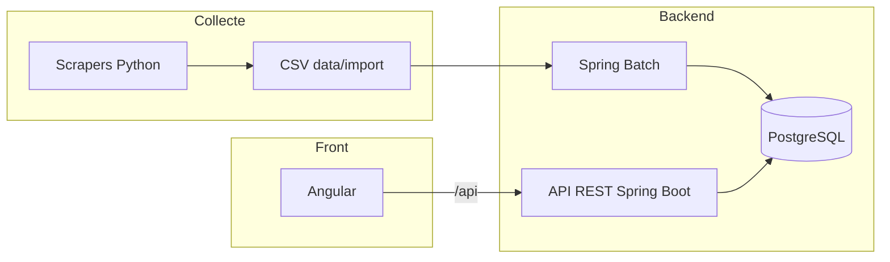

<p align="center">
  <a href="https://ovalytics.up.railway.app/"><strong>Voir la démo en ligne</strong></a>
</p>

# Ovalytics

Hub rugby pour suivre ses clubs : calendrier, scores, classement, actu, mercato, et une fiche match qui propose une vraie lecture d’avant-match.

<p align="center">
  
  
  
  
  
  
</p>

---

## Pourquoi ce projet

Les sites de scores donnent l’affiche et le résultat. La lecture d’avant-match reste souvent une phrase, sans relier absents, forme récente et contexte domicile / extérieur.

Ovalytics rassemble ça au même endroit, avec une analyse construite à partir des données déjà en base (Top 14 et Pro D2 pour commencer).

---

## Fonctionnalités

- Matchs à venir, résultats et classement
- Fiche match : forme, absences, confrontations, texte « Notre lecture »
- Actu, mercato et effectifs
- Scores en direct (rafraîchissement automatique)
- Imports Batch et scrapers pour alimenter PostgreSQL

---

## Architecture

| Couche | Techno | Rôle |
|--------|--------|------|
| API | Java 21, Spring Boot, Spring Batch, JPA | REST, domaine rugby, imports CSV |
| Client | Angular | Interface fan |
| Données | PostgreSQL | Clubs, joueurs, matchs, analyses |
| Collecte | Scripts Python | LNR, All Rugby, Rugbyrama → CSV |
| Run | Docker, Railway | Local et démo publique |



```text
backend/     API Spring + jobs Batch
frontend/    Site Angular
scripts/     Scrapers
data/import/ CSV
docs/        Runbook et infra
infra/       kind + Terraform (lab)
```

---

## Démarrage

API + Postgres :

```bash
docker compose up --build
```

Interface Angular (second terminal) :

```bash
cd frontend && npm install && npm start
```

- Healthcheck API : http://localhost:8080/api/health
- Application : http://localhost:4200
- Démo : [ovalytics.up.railway.app](https://ovalytics.up.railway.app/)

---

## Docs techniques

| Fichier | Contenu |
|---------|---------|
| [docs/DEV.md](docs/DEV.md) | Scrapers, imports Batch, Postgres local, miroir démo |
| [docs/INFRA.md](docs/INFRA.md) | Docker, Railway, Jenkins, kind, Terraform |

---

## Auteur

**Ayman Tebini** — développeur junior à Bordeaux.

Diplômé d’Epitech Digital School. 16 mois en agence digitale sur des cycles de delivery web et mobile. Ovalytics est le projet où je montre une chaîne complète : collecte des données, API Spring, UI Angular.

Ouvert aux opportunités tech sur la région bordelaise : [me contacter sur LinkedIn](https://www.linkedin.com/in/ayman-tebini-660b71232).
